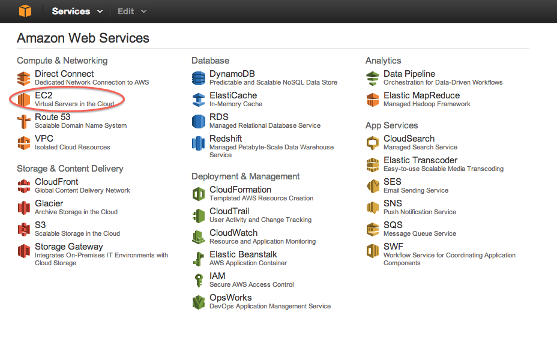
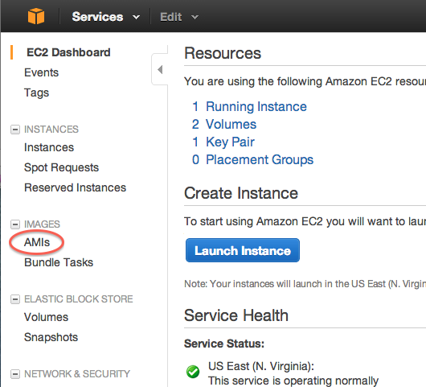
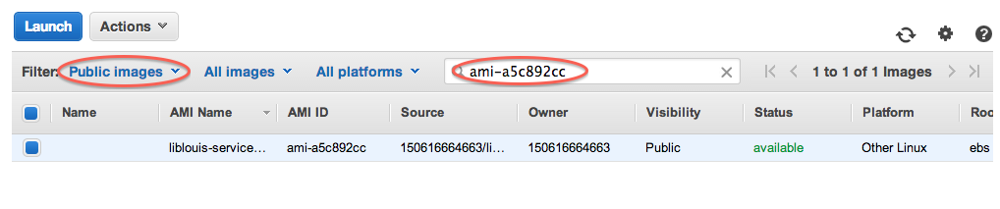
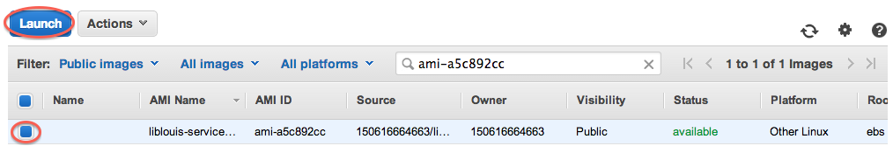
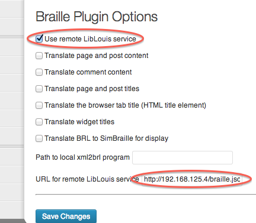

# Using the Remote LibLouis Amazon Machine Image

MITH has created a machine image that can be used with Amazon's EC2 offering. If you already have an account with Amazon Web Services and are comfortable navigating the management console, then you can use the AMI identifier `ami-a5c892cc` to create a new instance.

Running the smallest Amazon instance for a year will cost a little more than $175 at the current rates ($0.02 per hour as of December 2013). See [the Amazon EC2 price list](http://aws.amazon.com/ec2/pricing/) for more information on costs and the free tier for new accounts.

## Six Step Process

If you are not familiar with Amazon Web Service's web-based management system, then simply follow the following steps. If you already have an account with Amazon and have activated EC2 services, then you can skip step 0.

Each step has links to the relevant page in the Amazon Web Services mangement system. If the URLs are broken and these instructions have not been updated, then the narrative should point you in the right direction. If you have an account and already have an EC2 instance running, then you can probably jump directly to step 3 and follow the link.

### Step 0: Create an Amazon EC2 account

You will need an account with [Amazon's Web Services](http://aws.amazon.com/). You can sign in with your Amazon account and then activate the EC2 service. Amazon may ask you for billing information such as a credit card. Amazon Web Services charges are billed and paid separate from other Amazon-related services. EC2 instances cost anywhere from a few cents per hour to several dollars per hour. If you are enabling EC2 services for the first time, you might qualify for the free tier for a year.

### Step 1: Go to the EC2 Management Console

You will need to navigate through Amazon's site to the [Amazon Web Services management console](https://console.aws.amazon.com/console/home). From there, select [the EC2 link](https://console.aws.amazon.com/ec2/v2/home).

### Step 2: Go to the AMIs Management View

One of the options on the left side of the page is ["AMIs"](https://console.aws.amazon.com/ec2/v2/home#Images:). Selecting this will bring up a view allowing you to search for publicly available machine images.

### Step 3: Search for the LibLouis AMI

In the AMI view, [you should search public images (left-most filter at the top) for an AMI matching `ami-a5c892cc`](https://console.aws.amazon.com/ec2/v2/home#Images:filter=all-images;platform=all-platforms;visibility=public-images;search=ami-a5c892cc).

### Step 4: Launch the Service

Select the `liblouis-service` AMI and then the "Launch" button. From here, you can select the instance type and other settings as you need. If you are trying out the service for the first time or you don't need to make thousands of requests per hour, you should be fine with the default micro instance.

Once you have changed any settings that you need to, select the "Review and Launch" button towards the bottom of the page. This should start up an instance and give you the IP address.

**N.B.:** If you have not used an Amazon EC2 instance before, you may need to create an SSH key pair or provide other information. Amazon's launch wizard will step you through the processes depending on what you need to do.

### Step 5: Use the Service

After launching the service, you can configure your WordPress site to use this service. The URL will be based on the IP address of the service as reported in Step 4. For example, if the IP address is 192.168.125.4, then the URL of the service is http://192.168.125.4/braille.json. See the documentation for the WordPress plugin for more information on configuring the plugin to use the remote LibLouis service.

## Server organization

The server is running [Ubuntu 12.04 LTS](http://releases.ubuntu.com/precise/).

The server uses `nginx` to provide the world-facing web service. The version of `nginx` we use is installed in `/opt/nginx`, but the `nginx` application is linked to `/sbin/nginx` so that the standard initialization and control scripts work. The configuration is in `/opt/nginx/conf/` instead of `/etc/nginx/`.

The [LibLouis translation service](./remote-liblouis) is installed in `/home/ubuntu/remote-liblouis`.
