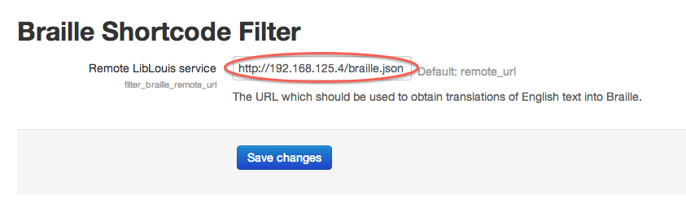

# Braille Translation Filter for Moodle 2.x

This plugin should be considered to be alpha software for now. It is being
developed with active testing on a single Moodle installation. While it may be
useful in conjunction with a Braille translation service, it is not packaged
and distributed as a one-click installation. However, the following Moodle
documentation may prove helpful in installing and configuring the filter.

* [Basic Moodle Filter Development](http://docs.moodle.org/dev/Filters)
* [Managing Filters](http://docs.moodle.org/26/en/Managing_filters)

## Short codes

The filter provides a number of short codes.

### BDots

This short code allows you to enter the dot codes for Braille characters to
be rendered using the UTF-8 range for Braille. The result is the display of
the dot patterns on the computer display. The text is encoded in the web
page as Braille, so any user software should be able to distinguish the
appearance of Braille characters from non-Braille characters.

```
[BDots 123 0 456]
```

The above example will result in three Braille cells. The first cell will
show the left column of dots. The second cell will show no dots (i.e., a
Braille spacing character). The third cell will show the right column of
dots.

Underscores and zeros are interchangeable for a Braille spacing cell.

Other characters may be mixed in with the numbers for legibility. For
example, all of the following are equivalent: `124` `1.2.4` `1-2-4` `1_2_4`
`12.4..`. As long as the cell patterns are separated by spaces, any
non-digit characters are ignored.

### EmbBraille

This short code allows you to translate English text into the ASCII codes for
embossing Braille. The translation service works well with plain ASCII
English text, but doesn't handle some special characters such as em-dashes.
The translation service also does not work with Nemeth Braille for math text.

```
[EmbBraille]English text to be translated to embossing codes.[/EmbBraille]
```

**N.B.:** This short code requires the configuration of the remote 
translation service. For more information, see the configuration section 
below.

### SimBraille

This short code allows you to translate English text into the UTF-8 codes for
Braille. The translation service works well with plain ASCII English text, 
but doesn't handle some special characters such as em-dashes. The translation
service also does not work with Nemeth Braille for math text.

```
[SimBraille]English text to be translated to UTF-8 Braille codes.[/SimBraille]
```

**N.B.:** This short code requires the configuration of the remote 
translation service. For more information, see the configuration section 
below.

## Configuration

Braille translation requires the use of a remote translation service as
described in the [top-level README](../README.md). [An Amazon machine image 
is available](../USING-REMOTE-LIBLOUIS-AMI.md) with which you may start such 
a service.

Once you have a remote translation service available, you can configure the
Moodle filter by going to Site Administration > Plugins > Filters > Braille
Shortcode Filter. Enter the URL of the translation service in the text box 
for "Remote LibLouis service".

In the following image, we have copied the location of the remote translation
service from the instructions for setting up an instance of the translation
service on Amazon's EC2 cloud service.

